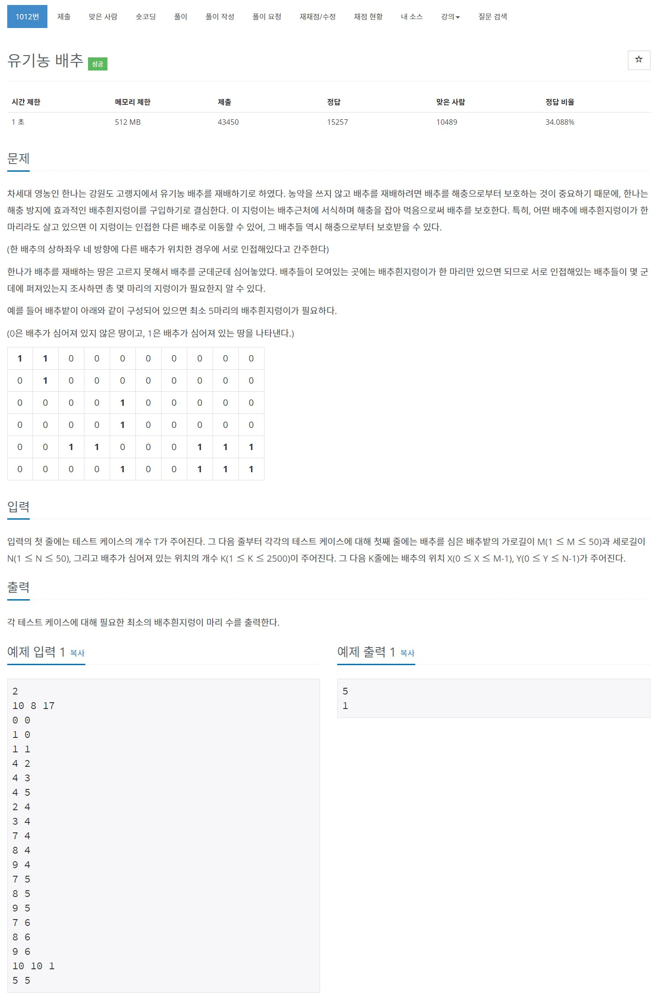

# 풀이

단지 나누기 문제와 비슷하다.

1. map의 처음부터 끝까지 하나씩 살펴본다.
2. 1일 경우 BFS를 사용하여 상, 하, 좌, 우도 방문한다.
3. BFS를 한번 할때마다 정답에 1씩 더한다.


``` java
import java.io.BufferedReader;
import java.io.IOException;
import java.io.InputStreamReader;
import java.util.LinkedList;
import java.util.Queue;
import java.util.StringTokenizer;

public class Main {
	private static class Position {
		int x;
		int y;
		
		public Position(int x, int y) {
			this.x = x;
			this.y = y;
		}
	}
	
	public static void main(String[] args) throws IOException {
		BufferedReader br = new BufferedReader(new InputStreamReader(System.in));
		StringTokenizer st;
		
		int T = Integer.parseInt(br.readLine());
		for(int tc = 0; tc < T; tc++) {
			st = new StringTokenizer(br.readLine());
			COL = Integer.parseInt(st.nextToken());
			ROW = Integer.parseInt(st.nextToken());
			int K = Integer.parseInt(st.nextToken());
			
			map = new int[ROW][COL];
			visited = new boolean[ROW][COL];
			ans = 0;
			
			for(int i = 0; i < K; i++) {
				st = new StringTokenizer(br.readLine());
				int c = Integer.parseInt(st.nextToken());
				int r = Integer.parseInt(st.nextToken());
				
				map[r][c] = 1;
			}
			
			for(int r = 0; r < ROW; r++) {
				for(int c = 0; c < COL; c++) {
					if(visited[r][c] || map[r][c] == 0) continue;
					
					BFS(new Position(r, c));
				}
			}
			
			System.out.println(ans);
		}
	}
	
	private static int ROW;
	private static int COL;
	private static int[][] map;
	private static boolean[][] visited;
	private static int ans;
	
	private static int[] dx = {-1, 1, 0, 0};
	private static int[] dy = {0, 0, -1, 1};
	
	private static boolean inRange(int nx, int ny) {
		return nx >= 0 && ny >= 0 && nx < ROW && ny < COL;
	}
	
	private static void BFS(Position p) {
		Queue<Position> q = new LinkedList<>();
		q.add(p);
		ans++;
		visited[p.x][p.y] = true;
		
		while(!q.isEmpty()) {
			Position tmp = q.poll();
			
			for(int d = 0; d < 4; d++) {
				int nx = tmp.x + dx[d];
				int ny = tmp.y + dy[d];
				
				if(!inRange(nx, ny)) continue;
				if(visited[nx][ny] || map[nx][ny] == 0) continue;
				
				q.add(new Position(nx, ny));
				visited[nx][ny] = true;
			}
		}
	}
}
```

