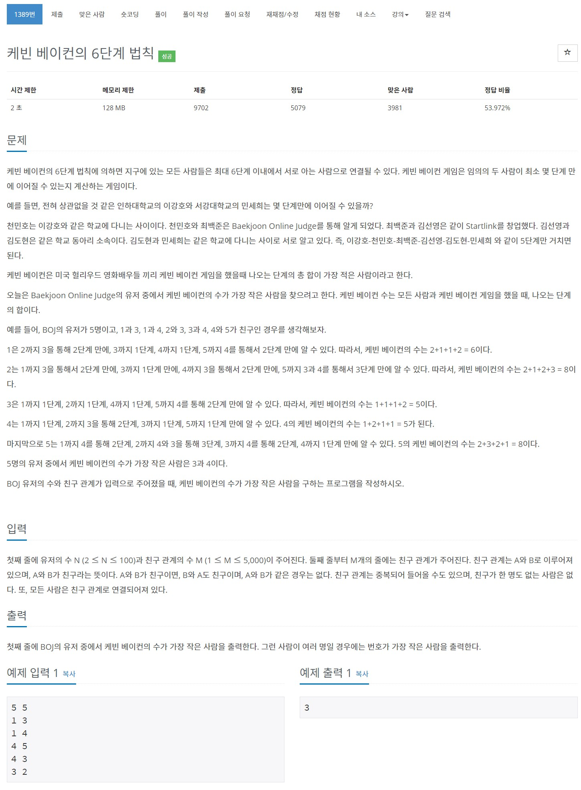

# 풀이

지도를 탐색하는 BFS가 아닌 배열에 저장된 친구 관계에 따라 케빈 베이컨의 수를 구하는 문제.

탐색이 아닌 이러한 문제는 몇번을 해도 약간 헷갈리는 것 같다. 이 유형을 여러 문제를 풀어봐야 될듯....

boolean 2차원 배열에 친구 관계를 저장하고 BFS를 통하여 케빈 베이컨의 수를 구하면 문제가 해결된다.


``` java
import java.io.BufferedReader;
import java.io.IOException;
import java.io.InputStreamReader;
import java.util.LinkedList;
import java.util.Queue;
import java.util.StringTokenizer;

public class Main {
	public static void main(String[] args) throws IOException {
		BufferedReader br = new BufferedReader(new InputStreamReader(System.in));
		StringTokenizer st;
		
		st = new StringTokenizer(br.readLine());
		int N = Integer.parseInt(st.nextToken()); // 유저의 수
		int M = Integer.parseInt(st.nextToken()); // 친구 관계의 수
		
		boolean[][] friends = new boolean[N + 1][N + 1];
		for(int i = 0; i < M; i++) {
			st = new StringTokenizer(br.readLine());
			int a = Integer.parseInt(st.nextToken());
			int b = Integer.parseInt(st.nextToken());
			
			friends[a][b] = friends[b][a] = true;
		}
		
		int[] ans = new int[N + 1]; // 케빈 베이컨 수 저장
		
		// 1번부터 N번 까지의 사람의 케빈 베이컨 수를 계산
		for(int num = 1; num <= N; num++) {
			for(int i = 1; i <= N; i++) { // 자기 자신을 제외한 모든 사람과 케빈 베이컨 수 계산
				if(num == i) continue;
				
				boolean[] visited = new boolean[N + 1];
				Queue<int[]> q = new LinkedList<>();
				q.add(new int[] {num, 0});
				
				boolean flag = true;
				while(!q.isEmpty() && flag) {
					for(int j = 1; j <= N; j++) {
						int[] tmp = q.poll();
						
						if(tmp[0] == i) {
							ans[num] += tmp[1];
							flag = false;
							break;
						}
						
						visited[ tmp[0] ] = true;
						
						for(int k = 1; k <= N; k++) {
							if(visited[k] || !friends[ tmp[0] ][k]) continue;
							
							q.add(new int[] {k, tmp[1] + 1});
						}
					}
				}
			}
		}
		
		int min_num = Integer.MAX_VALUE;
		for(int i = 1; i <= N; i++)
			min_num = Math.min(min_num, ans[i]);
		
		for(int i = 1; i <= N; i++) {
			if(ans[i] == min_num) {
				System.out.println(i);
				break;
			}
		}
	}
}
```

