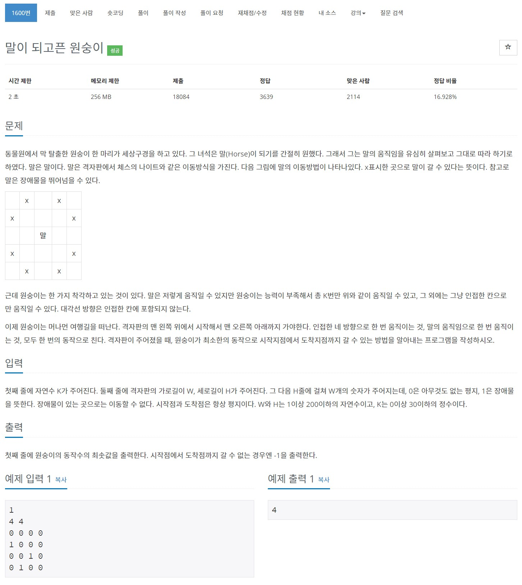

# 풀이

원숭이의 움직임 방향 배열과 말의 움직임 방향 배열을 따로 선언합니다.

원숭이 클래스에 k 값을 선언해서 K번 보다 많이 말의 움직임으로 못움직이게 합니다.

처음 문제를 풀때는 visited 배열을 2차원 배열로 선언하여 풀었는데, 기본 예제만 맞고 여러 가지 반례들은 다 틀려서 고민하였습니다.

결국 해결을 못하고 검색한 후, visited 배열을 3차원 배열로 선언하는 방법으로 해결가능 하다는 것을 알았습니다. 방범은 알았으나, 이해하기가 매우 까다로워서 한참 고민하였습니다.

3차원 배열로 선언한 이유는 현재 경로가 아닌 다른 경로에서 먼저 방문했을 때 현재 경로에서 해당 위치를 방문하지 못하는 문제점이 발생하기 때문입니다.

그리고 W랑 H를 바꿔 쓴 부분이 많아서 틀린점도 있습니다.... (문제 짜증남...ㅠㅠ)


``` java
import java.io.BufferedReader;
import java.io.IOException;
import java.io.InputStreamReader;
import java.util.LinkedList;
import java.util.Queue;
import java.util.StringTokenizer;

public class Main {
	private static class Monkey {
		int x, y, cnt, k;

		public Monkey(int x, int y, int cnt, int k) {
			this.x = x;
			this.y = y;
			this.cnt = cnt;
			this.k = k;
		}
	}
	
	public static void main(String[] args) throws IOException {
		BufferedReader br = new BufferedReader(new InputStreamReader(System.in));
		StringTokenizer st;
		
		K = Integer.parseInt(br.readLine());
		
		st = new StringTokenizer(br.readLine());
		W = Integer.parseInt(st.nextToken());
		H = Integer.parseInt(st.nextToken());
		
		map = new int[H][W];
		visited = new boolean[H][W][K + 1];
		for(int r = 0; r < H; r++) {
			st = new StringTokenizer(br.readLine());
			for(int c = 0; c < W; c++)
				map[r][c] = Integer.parseInt(st.nextToken());
		}
		 
		sol = Integer.MAX_VALUE;
		
		BFS();
		
		System.out.println(sol == Integer.MAX_VALUE ? -1 : sol);
	}
	
	private static int K;
	private static int W;
	private static int H;
	private static int[][] map;
	private static boolean[][][] visited;
	private static int[] dx = {0, 0, -1, 1};
	private static int[] dy = {-1, 1, 0, 0};
	private static int[] hx = {-1, -2, -2, -1, 1, 2, 2, 1};
	private static int[] hy = {-2, -1, 1, 2, 2, 1, -1, -2};
	private static int sol;
	
	private static boolean inRange(int nx, int ny) {
		return nx >= 0 && ny >= 0 && nx < H && ny < W;
	}
	
	private static void BFS() {
		Queue<Monkey> q = new LinkedList<>();
		q.add(new Monkey(0, 0, 0, K));
		visited[0][0][K] = true;
		
		while(!q.isEmpty()) {
			Monkey tmp = q.poll();
			
			if(tmp.x == H - 1 && tmp.y == W - 1) {
				sol = tmp.cnt;
				return;
			}
			
			for(int d = 0; d < 4; d++) {
				int nx = tmp.x + dx[d];
				int ny = tmp.y + dy[d];
				
				if(!inRange(nx, ny) || map[nx][ny] == 1 || visited[nx][ny][tmp.k]) continue;
				visited[nx][ny][tmp.k] = true;
				
				q.add(new Monkey(nx, ny, tmp.cnt + 1, tmp.k));
			}
			
			if(tmp.k == 0) continue;
			
			for(int d = 0; d < 8; d++) {
				int nx = tmp.x + hx[d];
				int ny = tmp.y + hy[d];
				
				if(!inRange(nx, ny) || map[nx][ny] == 1 || visited[nx][ny][tmp.k - 1]) continue;
				visited[nx][ny][tmp.k - 1] = true;
				
				q.add(new Monkey(nx, ny, tmp.cnt + 1, tmp.k - 1));
			}
		}
	}
}
```

