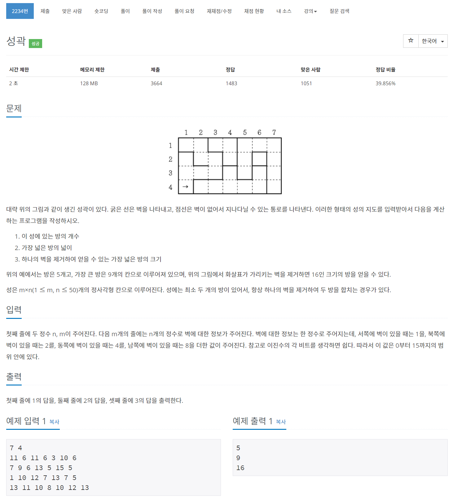

# 풀이

작년에는 풀지 못했던 문제...ㅠ

벽이 있는 BFS 문제 유형이다. 4비트 2진수 값으로 벽 정보를 표시한다.


### 벽 정보

0001  :  **<span style="color: blue">서</span>**

0010  :  **<span style="color: blue">북</span>**

0100  :  **<span style="color: blue">동</span>**

1000  :  **<span style="color: blue">남</span>**


만약 지도에서 값이 11일 때 어느 방향으로 벽이 있는지 알아보는 방법은 비트 연산을 통해서 알아보면 된다.

d라는 정수 배열에 벽 정보를 저장한다면, 0이 아닌 값이 있으면 해당 위치에는 벽이 있다는 것으로 저장한다.

[ 11 & 1,  11 & 2,  11 & 4,  11 & 8 ]	=	[ 1,  2,  0,  8]

위의 경우 갑이 0인 동쪽을 제외한 서쪽, 북쪽, 남쪽에 벽이 있다는 소리이다.

이를 이용하여 1번과 2번 문제의 답은 평소 BFS 문제 처럼 쉽게 구할 수 있다.

마지막 3번 문제는 지도를 돌며 모든 곳에서 벽을 없애고 BFS를 실행하고 다시 벽을 넣는 방식으로 답을 찾으면 된다.


처음에는 멍청하게 벽을 허문후 모든 점에서 BFS를 실시하였는다. 그로 인해 메모리 초과가 계속 발생하여 엉뚱한 곳만 수정하고 있었다....ㅠㅠ

모든 점이 아닌 벽을 허문 그 점에서만 BFS를 실시하면 답도 얻고 메모리 초과도 뜨지 않는다.


``` java
import java.io.BufferedReader;
import java.io.IOException;
import java.io.InputStreamReader;
import java.util.LinkedList;
import java.util.Queue;
import java.util.StringTokenizer;

public class Main {
	private static class Room {
		int x, y;

		public Room(int x, int y) {
			this.x = x;
			this.y = y;
		}
	}
	
	public static void main(String[] args) throws IOException {
		BufferedReader br = new BufferedReader(new InputStreamReader(System.in));
		StringTokenizer st;
		
		st = new StringTokenizer(br.readLine());
		Col = Integer.parseInt(st.nextToken());
		Row = Integer.parseInt(st.nextToken());
		
		map = new int[Row][Col];
		for(int r = 0; r < Row; r++) {
			st = new StringTokenizer(br.readLine());
			for(int c = 0; c < Col; c++)
				map[r][c] = Integer.parseInt(st.nextToken());
		}
		
		roomCnt = 0;
		maxArea = Integer.MIN_VALUE;
		visited = new boolean[Row][Col];
		for(int r = 0; r < Row; r++) {
			for(int c = 0; c < Col; c++) {
				if(visited[r][c]) continue;
				
				BFS(new Room(r, c));
				roomCnt++;
			}
		}
		
		System.out.println(roomCnt);
		System.out.println(maxArea);
		
		maxArea = Integer.MIN_VALUE;
		
		for(int r = 0; r < Row; r++) {
			for(int c = 0; c < Col; c++) {
				int val = map[r][c];
				int[] d = {val & 1, val & 2, val & 4, val & 8};
						
				for(int i = 0; i < 4; i++) {
					if(d[i] == 0) continue;
					
					map[r][c] -= (int) Math.pow(2, i);
					
					visited = new boolean[Row][Col];
					BFS(new Room(r, c));
					
					map[r][c] += (int) Math.pow(2, i);
				}
				
			}
		}
		
		System.out.println(maxArea);
	}
	
	private static int Row;
	private static int Col;
	private static int[][] map;
	private static boolean[][] visited;
	
	private static int roomCnt;
	private static int maxArea;
	
	// 방향 배열 [서, 북, 동, 남]
	private static int[] dx = {0, -1, 0, 1};
	private static int[] dy = {-1, 0, 1, 0};
	
	private static boolean inRange(int nx, int ny) {
		return nx >= 0 && ny >= 0 && nx < Row && ny < Col;
	}
	
	private static void BFS(Room room) {
		Queue<Room> q = new LinkedList<>();
		q.add(room);
		visited[room.x][room.y] = true;
		
		int area = 1;
		while(!q.isEmpty()) {
			Room tmp = q.poll();
			int x = tmp.x;
			int y = tmp.y;
			int val = map[x][y];
			
			int[] d = {val & 1, val & 2, val & 4, val & 8};
			for(int i = 0; i < 4; i++) {
				if(d[i] != 0) continue;
				
				int nx = x + dx[i];
				int ny = y + dy[i];
				
				if(!inRange(nx, ny) || visited[nx][ny]) continue;
				
				area++;
				visited[nx][ny] = true;
				q.add(new Room(nx, ny));
			}
		}
		
		maxArea = Math.max(maxArea, area);
	}
}
```

