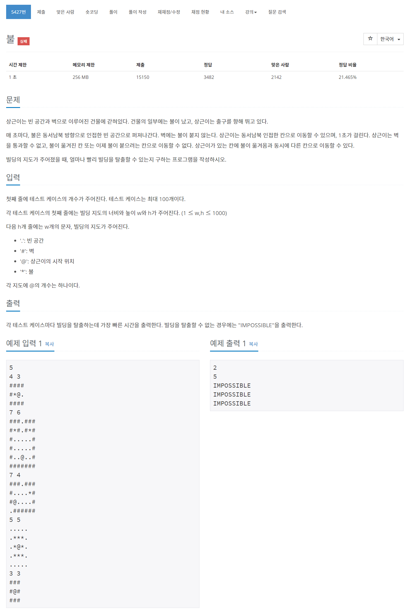

# 풀이

유저의 위치를 저장하는 큐와 불의 위치를 저장하는 큐를 생성한다.

불이 번지는 BFS를 먼저 실행하고 그 다음 유저가 이동하는 BFS를 실행하여 불이 붙으려고 하는 칸에 대해 이동을 못하는 문제를 해결한다.

과연 유저의 방문 배열이 필요한가???? 필요함!!!

종료 조건을 user 큐의 사이즈가 0이 되거나 유저의 다음 이동 위치가 맵을 벗어난다면 종료한다. 전자가 실패이고 후자가 성공이다.