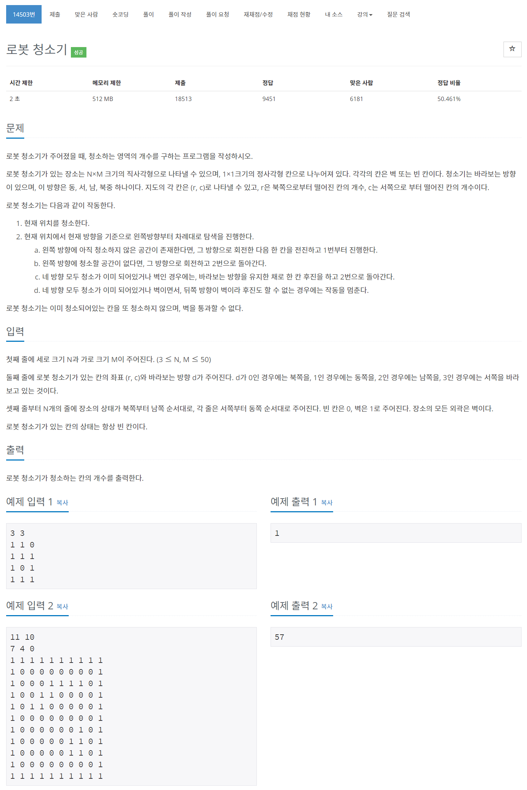

# 풀이

작년에 풀었을 때는 꽤 오랜 시간이 걸린 문제였지만 이번에는 쉽게 풀 수 있었다.

로봇은 현재 위치를 기준으로 왼쪽 방향 부터 탐색.

|           | 0 (-1, 0) |          |
| --------- | --------- | -------- |
| 3 (0, -1) | 현재 위치 | 1 (0, 1) |
|           | 2 (1, 0)  |          |


### <span style="color:grey">1. 방향 탐색 수식</span>

**현재 방향 : d**

**i = 1, 2, 3, 4**

**(4 + d - i) % 4  =>  4 방향 탐색**

**(d + 2) % 4  =>  바라보는 방향의 반대 방향 (후진 방향)**


위 수식을 사용하여 정해진 규칙대로 탐색을 하면 문제를 쉽게 해결할 수 있다.


``` java
import java.io.BufferedReader;
import java.io.IOException;
import java.io.InputStreamReader;
import java.util.LinkedList;
import java.util.Queue;
import java.util.StringTokenizer;

public class Main {
	private static class Robot {
		int r, c, d;

		public Robot(int r, int c, int d) {
			this.r = r;
			this.c = c;
			this.d = d; // 바라보는 방향
		}
	}
	
	public static void main(String[] args) throws IOException {
		BufferedReader br = new BufferedReader(new InputStreamReader(System.in));
		StringTokenizer st;
		
		st = new StringTokenizer(br.readLine());
		N = Integer.parseInt(st.nextToken()); // 가로 크기 Row
		M = Integer.parseInt(st.nextToken()); // 세로 크기 Col
		
		st = new StringTokenizer(br.readLine());
		Robot robot = new Robot(Integer.parseInt(st.nextToken()), Integer.parseInt(st.nextToken()), Integer.parseInt(st.nextToken()));
		
		map = new int[N][M];
		for(int r = 0; r < N; r++) {
			st = new StringTokenizer(br.readLine());
			for(int c = 0; c < M; c++)
				map[r][c] = Integer.parseInt(st.nextToken());
		}
		
		ans = 0;
		
		Cleaning(robot);
		
		System.out.println(ans);
	}
	
	private static int N;
	private static int M;
	private static int[][] map;
	
	private static int[] dx = {-1, 0, 1, 0};
	private static int[] dy = {0, 1, 0, -1};
	
	private static int ans;
	
	private static void Cleaning(Robot robot) {
		Queue<Robot> q = new LinkedList<>();
		q.add(robot);
		
		while(!q.isEmpty()) {
			Robot tmp = q.poll();
			int rr = tmp.r;
			int rc = tmp.c;
			int rd = tmp.d;
			
			// 현재 위치 청소
			if(map[rr][rc] == 0) {
				map[rr][rc] = 2;
				ans++;
			}
			
			// 네방향 탐색
			for(int i = 1; i <= 4; i++) {
				int nd = (4 + rd - i) % 4;
				int nr = rr + dx[nd];
				int nc = rc + dy[nd];
				
				if(!inRange(nr, nc) || map[nr][nc] != 0) continue;
				
				q.add(new Robot(nr, nc, nd));
				break;
			}
			
			if(!q.isEmpty()) continue;
			else if(finalChk(tmp)) return;
			else {
				int d = (tmp.d + 2) % 4;
				int nr = tmp.r + dx[d];
				int nc = tmp.c + dy[d];
				
				q.add(new Robot(nr, nc, rd));
			}
			
		}
	}
	
	private static boolean inRange(int nr, int nc) {
		return nr >= 0 && nc >= 0 && nr < N && nc < M;
	}
	
	// 종료 검사
	private static boolean finalChk(Robot robot) {
		int d = (robot.d + 2) % 4;
		int nr = robot.r + dx[d];
		int nc = robot.c + dy[d];
		
		return map[nr][nc] == 1 ? true : false;
	}
}
```

