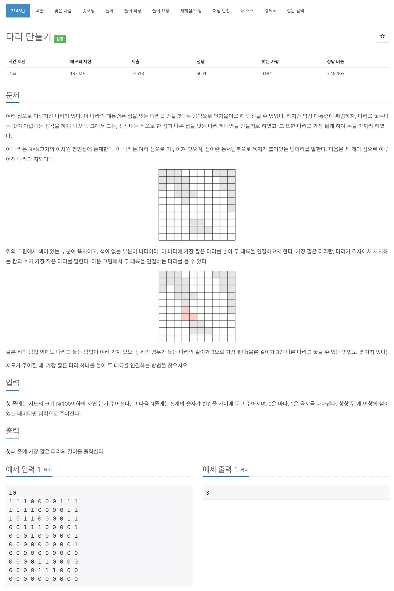

# 풀이

예전에 풀려다가 못풀었던 문제였다.

문제에서 우선 각 섬들을 구별할 수 있게 해야된다고 생각해서 지도를 돌며 섬들을 BFS로 숫자 2부터 넘버링 하였다.

그 후, 지도를 돌며 모든 섬들의 모서리 부분에서 BFS를 실시하여 섬과 섬사이의 거리를 계산하였다. 나온 거리와 정답 변수와 비교하여 최소값을 계속 갱신하는 방식으로 정답을 찾았다.

제출하여 문제를 맞춘 후, 혹시 다른 좋은 풀이를 참고하려고 검색을 해보았다. 나와 같은 방식으로 푼 건 하나 밖에 찾지 못하였고, 다들 간척방법이라는 것을 통해서 문제를 해결하였다.

그래서 그 방법으로 풀기위해 설명을 읽고 코드를 봤지만 도저히 이해가 안되서 포기하였다....ㅠㅠ

다음번에 다시 문제를 푼다면 간척방법을 사용하여 풀이해봐야겠다.


``` java
import java.io.BufferedReader;
import java.io.IOException;
import java.io.InputStreamReader;
import java.util.LinkedList;
import java.util.Queue;
import java.util.StringTokenizer;

public class Main {
	private static class Dot {
		int x, y, dist;

		public Dot(int x, int y, int dist) {
			this.x = x;
			this.y = y;
			this.dist = dist;
		}
	}
	
	public static void main(String[] args) throws IOException {
		BufferedReader br = new BufferedReader(new InputStreamReader(System.in));
		StringTokenizer st;
		
		N = Integer.parseInt(br.readLine());
		map = new int[N][N];
		for(int i = 0; i < N; i++) {
			st = new StringTokenizer(br.readLine());
			for(int j = 0; j < N; j++)
				map[i][j] = Integer.parseInt(st.nextToken());
		}
		
		int num = 2;
		for(int r = 0; r < N; r++) {
			for(int c = 0; c < N; c++) {
				if(map[r][c] != 1) continue;
				
				numbering(new Dot(r, c, 0), num++);
			}
		}
		
		sol = Integer.MAX_VALUE;
		
		for(int r = 0; r < N; r++) {
			for(int c = 0; c < N; c++) {
				if(map[r][c] == 0 || !isEdge(r, c)) continue;
				
				BFS(new Dot(r, c, 0), map[r][c]);
			}
		}
		
		System.out.println(sol);
	}
	
	private static int N;
	private static int[][] map;
	private static boolean[][] visited;
	private static int[] dx = {-1, 1, 0, 0};
	private static int[] dy = {0, 0, -1, 1};
	private static int sol;
	
	private static boolean inRange(int nx, int ny) {
		return nx >= 0 && ny >= 0 && nx < N && ny < N;
	}
	
	private static void numbering(Dot dot, int num) {
		Queue<Dot> q = new LinkedList<>();
		q.add(dot);
		map[dot.x][dot.y] = num;
		
		while(!q.isEmpty()) {
			Dot tmp = q.poll();
			
			for(int d = 0; d < 4; d++) {
				int nx = tmp.x + dx[d];
				int ny = tmp.y + dy[d];
				
				if(!inRange(nx, ny) || map[nx][ny] != 1) continue;
				
				map[nx][ny] = num;
				q.add(new Dot(nx, ny, 0));
			}
		}
	}
	
	private static boolean isEdge(int x, int y) {
		for(int d = 0; d < 4; d++) {
			int nx = x + dx[d];
			int ny = y + dy[d];
			
			if(!inRange(nx, ny) || map[nx][ny] != 0) continue;
			
			return true;
		}
		return false;
	}
	
	private static void BFS(Dot dot, int num) {
		visited = new boolean[N][N];
		
		Queue<Dot> q = new LinkedList<>();
		q.add(dot);
		
		boolean flag = true;
		while(!q.isEmpty() && flag) {
			Dot tmp = q.poll();
			
			if(tmp.dist >= sol) break;
			
			for(int d = 0; d < 4; d++) {
				int nx = tmp.x + dx[d];
				int ny = tmp.y + dy[d];
				
				if(!inRange(nx, ny) || map[nx][ny] == num || visited[nx][ny]) continue;
				
				if(map[nx][ny] != 0) {
					sol = Math.min(sol, tmp.dist);
					flag = false;
					break;
				}
				
				q.add(new Dot(nx, ny, tmp.dist + 1));
				visited[nx][ny] = true;
			}
		}
	}
}
```

