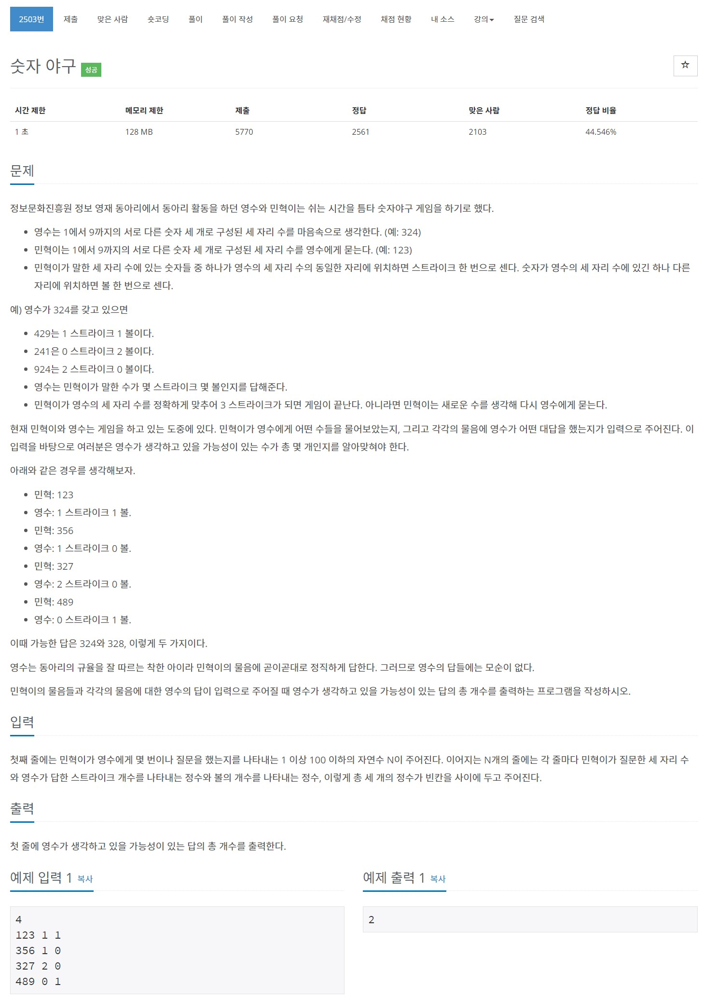

# 풀이

숫자야구를 푸는 완탐문제입니다.

3중 for문을 이용하여 123 부터 987 까지 생성하여 입력받은 질문과 비교합니다.

질문들의 스트라이크 볼 개수가 모두 일치하는 숫자를 찾으면 정답 + 1을 합니다.


``` java
import java.io.BufferedReader;
import java.io.IOException;
import java.io.InputStreamReader;
import java.util.StringTokenizer;

public class Main {
	private static class Question {
		String num;
		int strike, ball;
		
		public Question(String num, int strike, int ball) {
			this.num = num;
			this.strike = strike;
			this.ball = ball;
		}
	}
	
	public static void main(String[] args) throws IOException {
		BufferedReader br = new BufferedReader(new InputStreamReader(System.in));
		StringTokenizer st;
		
		int N = Integer.parseInt(br.readLine());
		qs = new Question[N];
		for(int i = 0; i < N; i++) {
			st = new StringTokenizer(br.readLine());
			qs[i] = new Question(st.nextToken(), Integer.parseInt(st.nextToken()), Integer.parseInt(st.nextToken()));
		}
		
		ans = 0;
		generateNumber();
		
		System.out.println(ans);
	}
	
	private static Question[] qs;
	private static int ans;
	
	private static void generateNumber() {
		for(int i = 1; i <= 9; i++) {
			for(int j = 1; j <= 9; j++) {
				if(i == j) continue;
					
				for(int k = 1; k <= 9; k++) {
					if(k == i || k == j) continue;
					
					String n = i + "" + j + "" + k;
					
					if(checkNumber(n))
						ans++;
				}
			}
		}
	}
	
	private static boolean checkNumber(String n) {
		for(int i = 0; i < qs.length; i++) {
			int strike = 0;
			int ball = 0;
			
			String num = qs[i].num;
			String tmp = n;
			
			for(int j = 0; j < 3; j++)
				if(num.charAt(j) == tmp.charAt(j))
					strike++;
			
			for(int j = 0; j < 3; j++) {
				for(int k = 0; k < 3; k++) {
					if(j == k)
						continue;
					
					if(num.charAt(j) == tmp.charAt(k))
						ball++;
				}
			}
			
			if(qs[i].strike != strike || qs[i].ball != ball)
				return false;
		}
		
		return true;
	}
}
```

