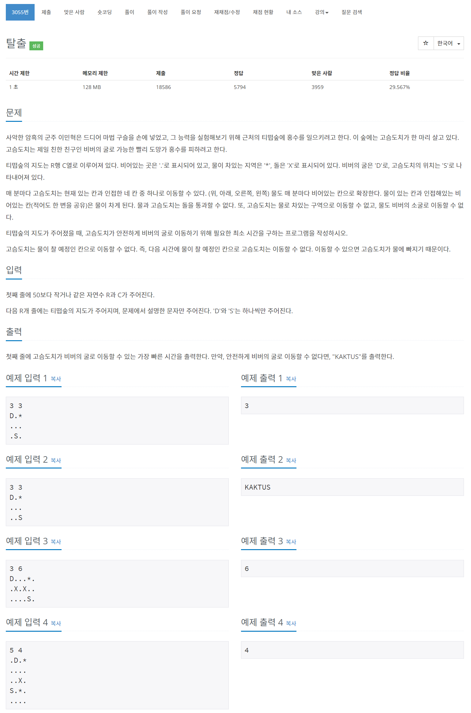

# 풀이

고슴도치의 탈출 시간을 체크하는 문제이다.

풀이를 3단계로 나누었다.

1. '*' 주위의 4방향을 '!' 로 변환
2. 'S' 이동, 단 기본 BFS가 아닌 딱 한번의 확장을 위해 큐를 전역변수로 선언하였다. 설명하기가 어렵다........
3. 모든 '!' 를 '*' 로 변환

위 3단계를 반복한다. 2단계에서 종료 조건을 확인한다.

BFS의 작동 방식을 정확하게 이해하고 있어야지 쉽게 해결가능한 문제인것 같다.


``` java
import java.io.BufferedReader;
import java.io.IOException;
import java.io.InputStreamReader;
import java.util.LinkedList;
import java.util.Queue;
import java.util.StringTokenizer;

public class Main {
	private static class Hedgehog {
		int x, y, cnt;

		public Hedgehog(int x, int y, int cnt) {
			this.x = x;
			this.y = y;
			this.cnt = cnt;
		}
	}
	
	public static void main(String[] args) throws IOException {
		BufferedReader br = new BufferedReader(new InputStreamReader(System.in));
		StringTokenizer st;
		
		st = new StringTokenizer(br.readLine());
		R = Integer.parseInt(st.nextToken());
		C = Integer.parseInt(st.nextToken());
		
		map = new char[R][C];
		visited = new boolean[R][C];
		for(int r = 0; r < R; r++) {
			map[r] = br.readLine().toCharArray();
			for(int c = 0; c < C; c++) {
				if(map[r][c] == 'S') {
					map[r][c] = '.';
					S = new Hedgehog(r, c, 0);
				}
			}
		}
		
		ans = -1;
		q = new LinkedList<>();
		q.add(S);
		visited[S.x][S.y] = true;
		
		flood();
		
		System.out.println(ans == -1 ? "KAKTUS" : ans);
	}
	
	private static int R;
	private static int C;
	private static char[][] map;
	private static boolean[][] visited;
	private static Hedgehog S;
	private static int ans;
	
	private static int[] dx = {-1, 1, 0, 0};
	private static int[] dy = {0, 0, -1, 1};
	
	private static boolean inRange(int nx, int ny) {
		return nx >= 0 && ny >= 0 && nx < R && ny < C;
	}
	
	private static void flood() {
		while(true) {
			for(int r = 0; r < R; r++) {
				for(int c = 0; c < C; c++) {
					if(map[r][c] != '*') continue;
					
					for(int d = 0; d < 4; d++) {
						int nx = r + dx[d];
						int ny = c + dy[d];
						
						if(!inRange(nx, ny) ||  map[nx][ny] != '.') continue;
						
						map[nx][ny] = '!';
					}
				}
			}
			
			if(BFS()) return; // 성공 유무 확인
			if(q.size() == 0) return; // 실패
		
			for(int r = 0; r < R; r++)
				for(int c = 0; c < C; c++)
					if(map[r][c] == '!')
						map[r][c] = '*';
		}
	}
	
	private static Queue<Hedgehog> q;
	private static boolean BFS() {
		int size = q.size();
		
		for(int i = 0; i < size; i++) {
			Hedgehog tmp = q.poll();
			
			for(int d = 0; d < 4; d++) {
				int nx = tmp.x + dx[d];
				int ny = tmp.y + dy[d];
				
				if(!inRange(nx, ny) || map[nx][ny] == '*' || map[nx][ny] == '!' || map[nx][ny] == 'X' || visited[nx][ny]) continue;
				
				if(map[nx][ny] == 'D') {
					ans = tmp.cnt + 1;
					return true;
				}
				
				visited[nx][ny] = true;
				q.add(new Hedgehog(nx, ny, tmp.cnt + 1));
			}
		}
		
		return false;
	}
}
```

